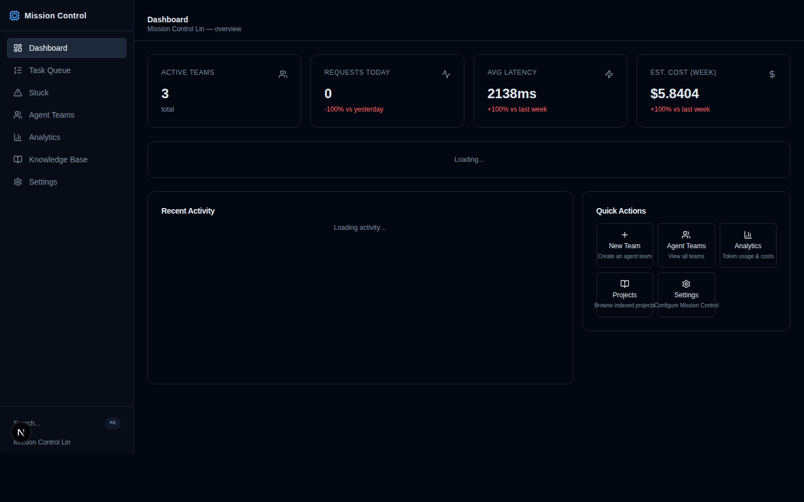
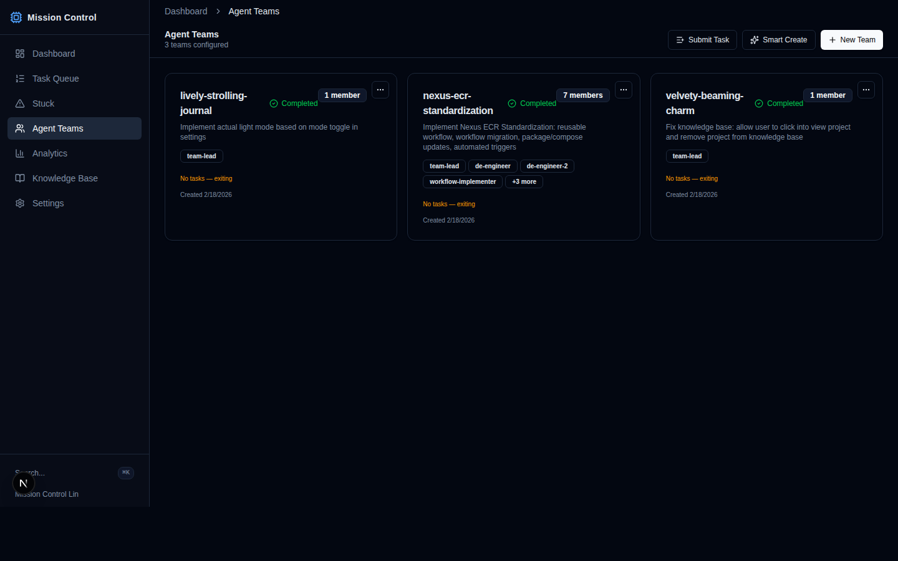
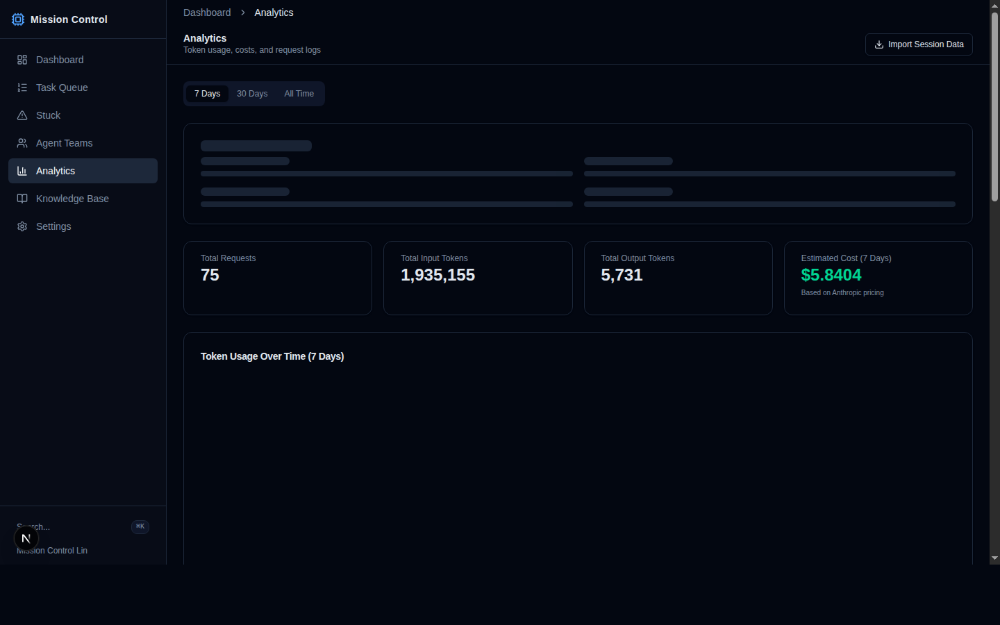
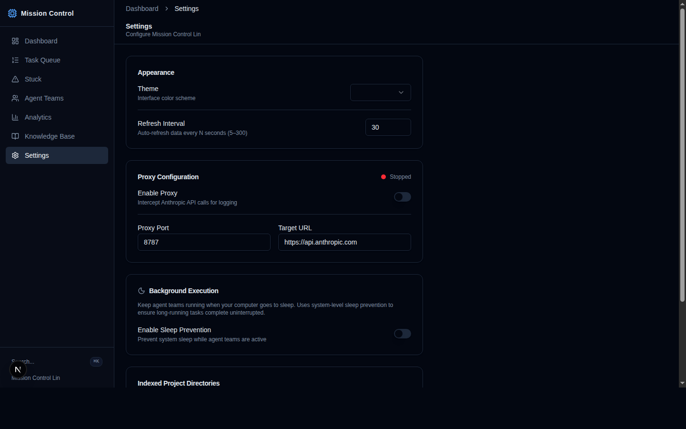

# Mission Control

A local dashboard for managing Claude Code agent teams, tracking API token usage, and monitoring costs. Runs entirely on your machine — no cloud services required.



## Features

### Agent Teams
Create, spawn, monitor, and shut down Claude Code agent teams via tmux. AI-assisted "Smart Create" generates team personas and task breakdowns from a goal description. Teams auto-detect completion and auto-archive after a grace period.



### Analytics
Track token usage, costs, and latency across models, teams, and individual agents. Import historical data from Claude Code session logs.



### Settings
Configure theme, polling intervals, API proxy, sleep prevention, and indexed project directories.



### Additional Features
- **Task Queue** — Submit tasks with file attachments that get routed to agent teams
- **Stuck Task Detection** — Surface tasks that are blocked or stalled across all teams
- **Knowledge Base** — Register and browse indexed project directories
- **API Proxy** — Transparent HTTP proxy that intercepts Anthropic API requests, extracts token counts from responses (JSON and SSE), and records them to a local SQLite database
- **Anthropic Admin API Sync** — Pull billing-accurate usage, cost, and Claude Code productivity data directly from Anthropic's Admin APIs (`/api/usage/*`)
- **Skills Browser** — View and manage Claude Code skill definitions from `~/.claude/skills/`
- **Command Palette** — Quick keyboard-driven navigation across the app

## Prerequisites

- Node.js 22+ (Prisma 7 requires Node 20.19+, 22.12+, or 24+)
- pnpm
- tmux (for agent team spawning)
- Claude Code CLI (`claude`) installed and authenticated

## Setup

```bash
pnpm install
npx prisma generate
pnpm db:push          # first time only
pnpm dev              # Next.js on :3777
```

Open [http://localhost:3777](http://localhost:3777).

### Optional: API Proxy

The proxy intercepts Anthropic API calls to record token usage per team/member:

```bash
pnpm proxy   # Starts on port 8787
```

Point Claude Code at the proxy by setting `ANTHROPIC_BASE_URL=http://localhost:8787`.

## Scripts

| Command | Description |
|---------|-------------|
| `pnpm dev` | Start Next.js dev server (port 3777) |
| `pnpm dev:all` | Generate Prisma client + start Next.js, proxy, and queue worker together |
| `pnpm build` | Production build |
| `pnpm start` | Start production server |
| `pnpm proxy` | Start API proxy (port 8787) |
| `pnpm queue` | Start task queue worker (auto-spawns teams for queued tasks) |
| `pnpm mcp` | Start MCP stdio server (used by Claude Code leader agents) |
| `pnpm db:push` | Push Prisma schema to SQLite |
| `pnpm db:generate` | Regenerate Prisma client |
| `pnpm lint` | Run ESLint |

## Architecture

```
Browser ──→ Next.js (port 3777)
               ├── Dashboard pages (React Server Components)
               ├── API routes (team CRUD, analytics, usage, queue, settings)
               └── Reads/writes ~/.claude/ (team configs, tasks)

Claude CLI ──→ Proxy (port 8787) ──→ Anthropic API
               └── Logs tokens to SQLite

Next.js (/api/usage/sync) ──→ Anthropic Admin API
               └── Syncs billing-accurate usage, cost, and Claude Code metrics to SQLite

Queue Worker (background) ──→ SQLite (QueuedTask table)
               └── Polls for pending tasks, runs smart-create + spawn

MCP Server (stdio) ──→ Claude leader agent
               └── Exposes TeamCreate, TeamDelete, SendMessage tools
```

**Data storage:**
- **SQLite** (`prisma/mission-control.db`) — proxy logs, analytics snapshots, usage/cost records, task queue, settings
- **Filesystem** (`~/.claude/teams/`, `~/.claude/tasks/`) — active team configs, task lists
- **Filesystem** (`~/.claude/teams-archive/`, `~/.claude/tasks-archive/`) — archived teams

**API routes (additive, no breaking changes to existing routes):**
- `/api/usage/sync` — sync token/cost data from Anthropic Admin APIs
- `/api/usage/status` — check sync state and Admin API key configuration
- `/api/usage/summary` — daily aggregated usage (supports `?source=api|proxy|all`)
- `/api/usage/by-model` — per-model token and cost breakdown
- `/api/usage/by-workspace` — per-Anthropic-workspace breakdown
- `/api/usage/claude-code` — Claude Code productivity metrics (sessions, LOC, commits, PRs)

## Tech Stack

Next.js 16 | React 19 | TypeScript | Tailwind CSS 4 | shadcn/ui | Prisma + SQLite | Recharts | tmux | Anthropic SDK
